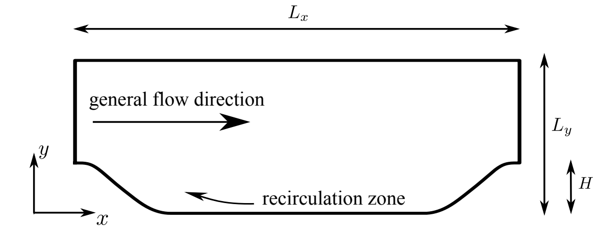

# 2D Periodic Hill Flow

### 文件名

periodic_hill.dat

### 数据集描述

问题的几何形状如下图所示。上下边界为无滑移壁面，左右边界分别为流动入口和出口的周期边界。计算域长度Lx=9mm，高度Ly=3.036mm，山峰高度H=1mm.雷诺数为5600.

### 数据格式

数据为十进制dat格式，共有210000行，10列。其中每列分别对应采样点的流向网格序号i，法向网格序号j，流向坐标x，法向坐标y，流向速度u，法向速度v，压强p，雷诺应力项uu，uv和vv。
